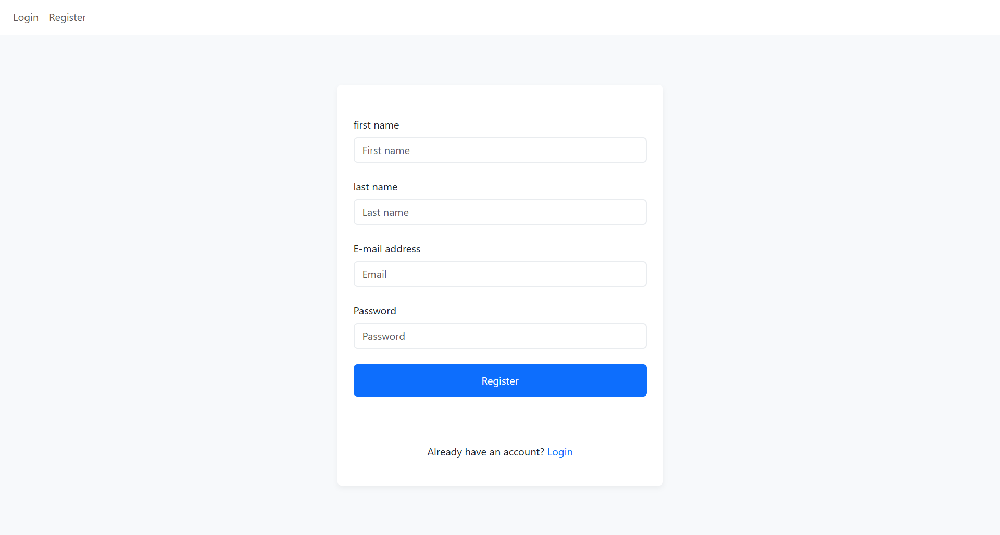
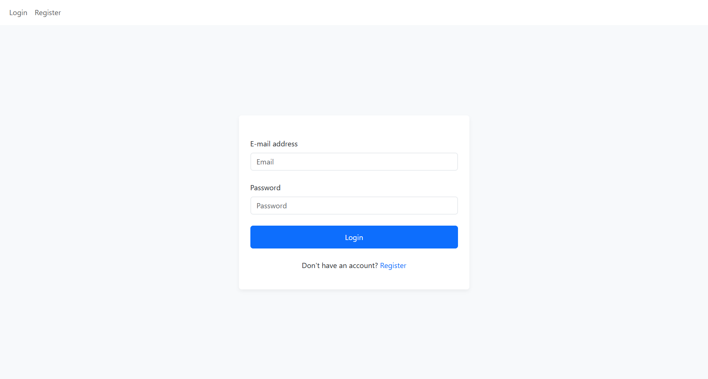
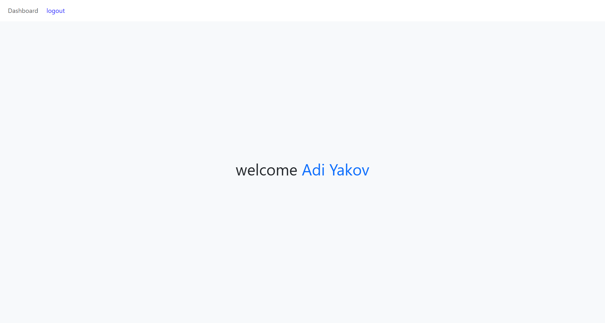

# Project : User Authentication System  


## Main Objective
This project was created for learning and practice purposes, in order to gain a better understand of:

- Architecture structure
- Technology stack usage
- Design patterns
- Core development concepts
- Programmatic data infrastructure

and additional concepts as the project continues to evolve.

---

## Learning Goals

The main goals of This project were:

- Understand Client-server architecture
- Build a REST API
- MVC design pattern
- Apply layerd architecture (Controller/ Service/ Repository)
- Implement Authentication & Security best practice
- Full-stack JavaScript development
- Working with PostgreSQL
- Practice with Docker-based env setup 
- Improve code quality through Refactoring & Error handling

---

## Key Concepts Covered

- REST API design
- JWT Authentication (Access & Refresh Tokens)
- HTTP-only Cookies
- CSRF Protection
- Token Refresh Flow & Rotation
- Rate Limiting
- Secure password hashing (bcrypt)
- CORS & cross-origin requests
- Docker containerization

---

## About - Project Overview

This project is an authentication system built using Node.js, Express, and PostgreSQL.

It includes core features such as user registration, login, JWT-based authentication, security, and protected routes.

The system follows a client–server architecture, where the client communicates with the server through a REST API.

The backend is structured using a layered architecture inspired by the MVC pattern, separating concerns into controllers, services, and repositories to improve maintainability and scalability.

---

## Technology Stack

### Frontend (Client Side)

- HTML5
- CSS3
- Bootstrap (framework)
- Vanilla JavaScript (SPA structure)

### Backend (Server Side)

- Node.js
- Express.js
- REST API architrcture

### Database

- PostgreSQL

### DevOps

- Docker
- Docker Compose

---

## Features

- User registration & Login forms
- Protected dashboard (authenticated access only)
- JWT-based authentication (access & refresh)
- Secure Cookie (httpOnly , sameSite)
- CSRF protection
- Token refresh mechanism
- Rate limiter (API protection)
- Layered backend architecture (Controller / Service / Repository)
- Dockerized enviroment

## Project Structure

        project /
        │
        ├── Client /              # Frontend files
        |   ├── config /          # state's setting 
        |   ├── components /      # reusable components        
        |   ├── pages /           # page interface 
        |   ├── routes /          # navigation routing 
        |   ├── services /        # handle request
        |   ├── utils /           # utilities function 
        |   └── public /          # static files 
        │
        └── Server /            # Backend (Node.js / API)
            ├── database /      # storage,migration,seed
            └── src /           # backend files
                ├── routes /        # API routes (endpoint mapping)
                ├── middleware /    # auth, validation etc..
                ├── controllers /   # handle HTTP req / res 
                ├── services /      # business loginc
                ├── repositories /  # database queries
                ├── db /            # database connection
                ├── utils /         # utilities function
                └── config /        # app configuration
        


## Authentication Flow

### 1. Register

→ User submits registration form  
→ Server validates input  
→ Password is hashed using bcrypt  
→ User is saved in the database  
→ User redirect to Login page 



---

### 2. Login

→ User submits credentials  
→ Server verifies credentials  
→ Password is compared using bcrypt  
→ Access Token (short-lived) created  
→ Refresh Token (long-lived) created  
→ Tokens stored in httpOnlycookies  
→ User redirect to protected pages



---

### 3. Access Protected Routes

→ Client sends request with cookies  
→ Middleware verifies access token  
→ If valid => allow access  
→ If expire => trigger refresh flow  



### 4. Token Refresh

→ Client detects 401 response  
→ Sends request to `/refresh`  
→ Server validates refresh token  
→ New access token issued

---

## Security

- Passwords hashing with bcrypt
- httpOnly cookies (prevent XSS access)
- CSRF protection using Token 
- Refresh token rotation (prevent reuse attacks)
- Rate limiting (prevent brute-force attacks)
- input validation & sanitiztion (Regex) 
- Sensitive data nevver exposed

---

## Setup
###  Docker Setup

This project runs in a containerized environment using Docker.

### Services:

- `frontend` → serves client (port 8080)
- `backend` → API server (port 3000)
- `postgres` → database (port 5432)

### Run project:
```bash
docker-compose up --build
```

### Installation (Without Docker)


Clone the repository:

    git clone https://github.com/yourusername/user-form-project.git

Install dependencies:

    npm install

Run the server:

    npm start


### Environment Variables (Example)

    PORT=3000  
    DB_HOST=postgres_db  
    DB_USER=postgres  
    DB_PASSWORD=yourpassword  
    JWT_SECRET=your_secret  
    REFRESH_SECRET=your_refresh_secret

## API Endpoints

    POST /api/auth/register  
    POST /api/auth/login  
    POST /api/auth/refresh  
    GET  /api/auth/profile  
    POST /api/auth/logout      


## Future Improvements

- Implement advanced validation (e.g. Joi / Zod)
- Add refresh token mechanism (refresh token rotation)
- Rate limiter
- Coockies (httpOnly)
- Improve error handling with centralized middleware
- Add role-based authorization (admin / user)
- Migrate token storage to httpOnly cookies for better security